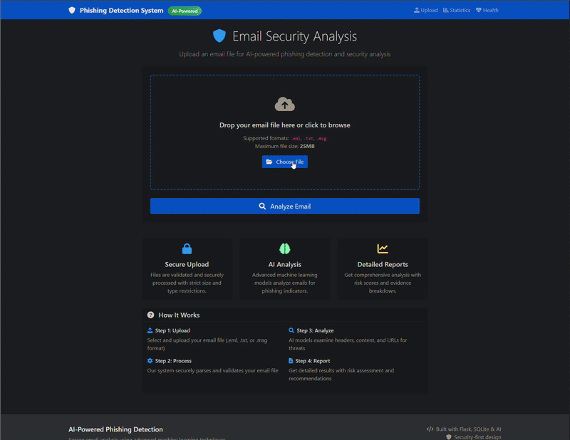
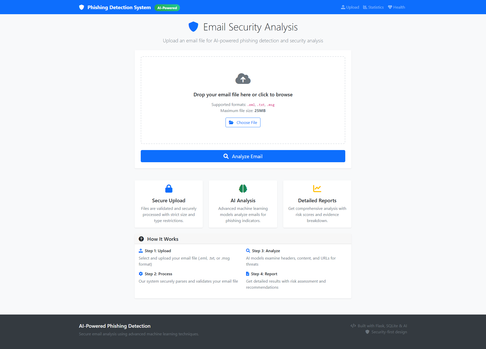
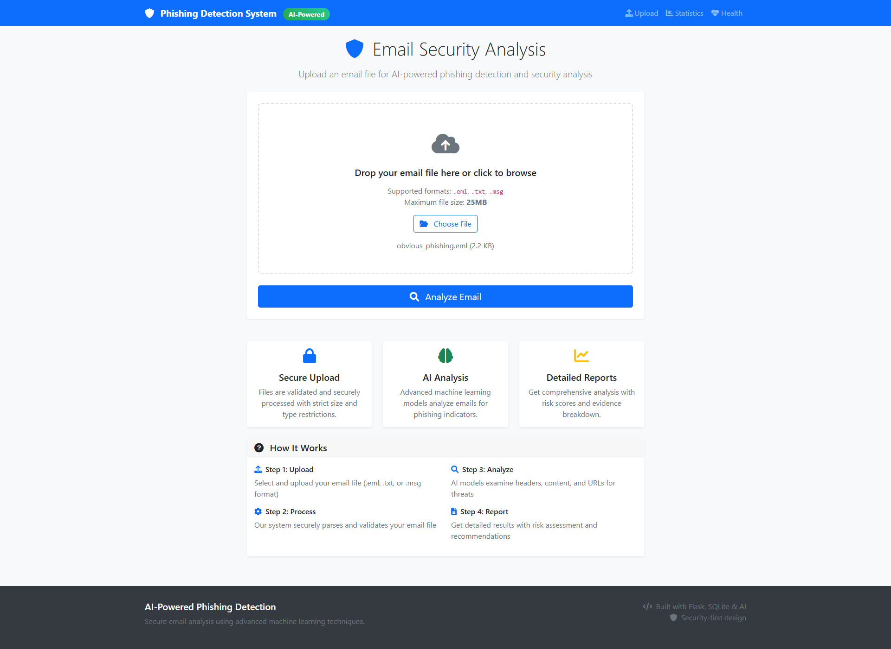
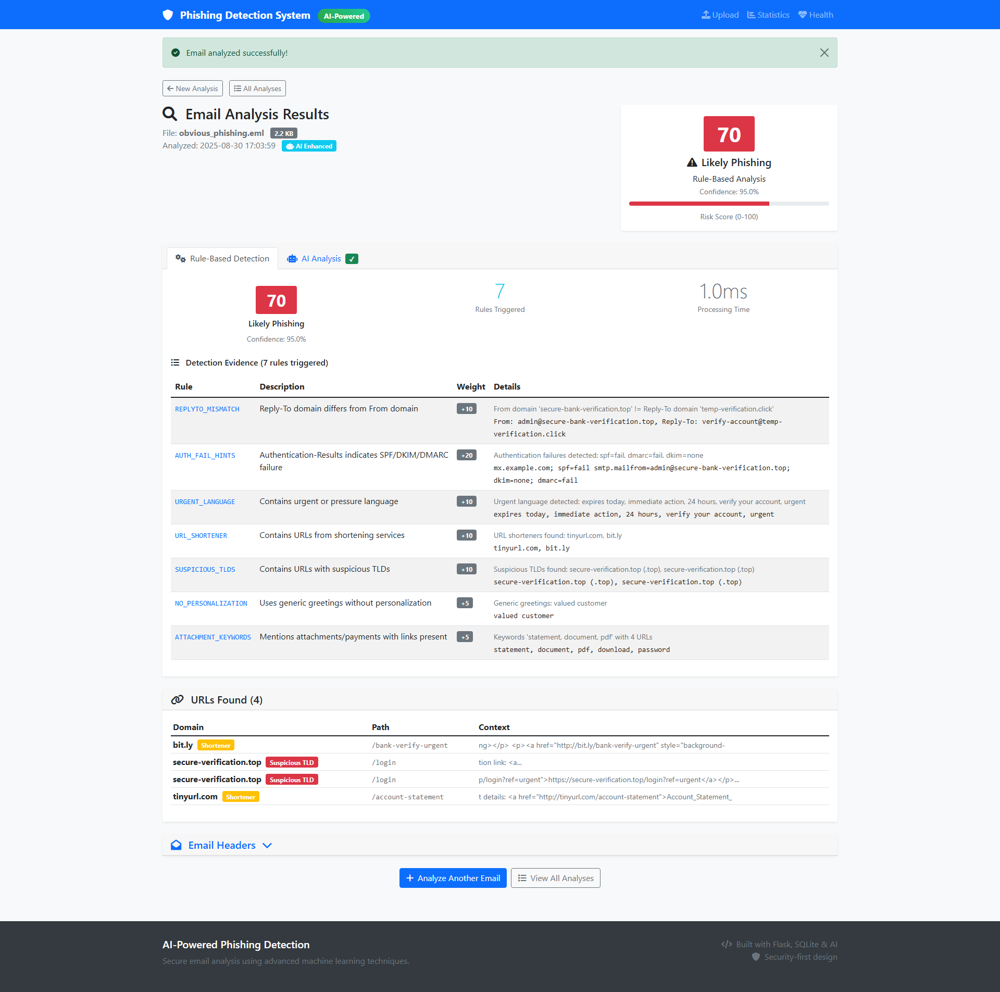
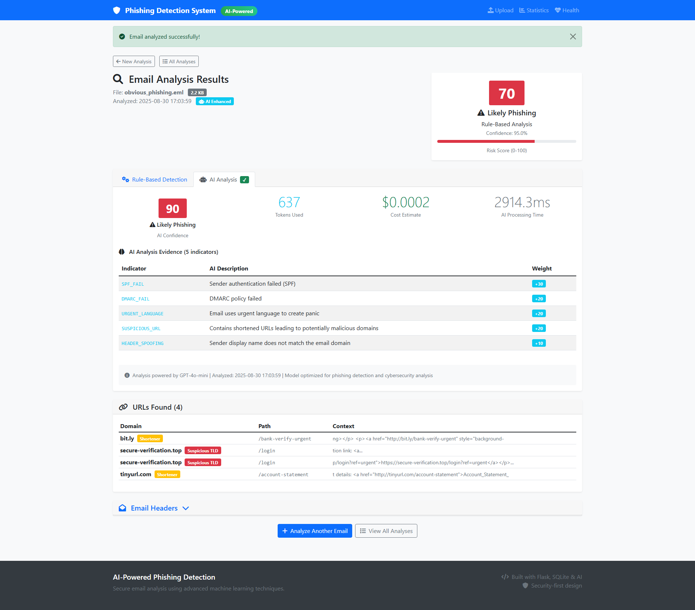
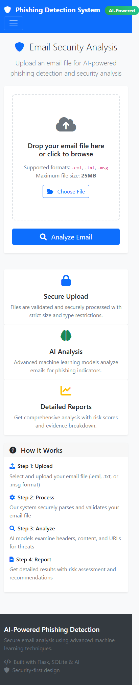

# 🛡️ AI-Powered Phishing Detection System
## 🎓 Computer Science Portfolio Project by Richard Blea
### 🚀 **v2.0.0 Phase 4: Advanced Features & Production-Ready Architecture** 

[](https://python.org)
[](https://flask.palletsprojects.com/)
[](https://openai.com/)
[](https://redis.io/)
[](docker-compose.yml)
[](LICENSE)
[](https://github.com/Rblea97/Phishing_Email_analyzer/actions/workflows/ci.yml)
[](docs/evaluation.md)
[](docs/SECURITY.md)
[](PHASE4_COMPLETION_SUMMARY.md)
[](https://www.linkedin.com/in/richard-blea-748914159)

> **🎊 MAJOR UPDATE: Phase 4 Complete - Advanced Cybersecurity Engineering Skills Demonstrated!**
> 
> **Academic cybersecurity project showcasing advanced software engineering, AI/ML integration, microservices architecture, and production deployment skills. Demonstrates my ability to build scalable, production-ready security systems with real-time threat intelligence, batch processing, caching, and comprehensive monitoring.**

### 👨‍💻 About the Developer
**Richard Blea** | CU Denver Computer Science Student | Cybersecurity Professional in Training  
📧 [rblea97@gmail.com](mailto:rblea97@gmail.com) | 💼 [LinkedIn](https://www.linkedin.com/in/richard-blea-748914159) | 📍 Denver, CO | 🎓 Graduating Spring 2026  
**Seeking entry-level cybersecurity positions: SOC Analyst, Information Security Analyst**

## 🎯 Project Overview

This personal cybersecurity project demonstrates advanced software engineering and security skills through a sophisticated phishing detection system. What started as a coursework-inspired project has evolved into a **production-ready security platform** (v2.0.0-Phase4) showcasing modern development practices and cybersecurity technologies.

**🚀 Phase 4 Technical Achievement:** Successfully designed and implemented 5 microservices, 8 REST API endpoints, real-time threat intelligence integration, async batch processing, Redis caching, and comprehensive system monitoring - demonstrating my ability to architect and deploy complex, scalable security systems.

### 🎓 Technical Skills Demonstrated (Phase 4)
- **Software Architecture**: Microservices design, service orchestration, graceful degradation patterns
- **API Integration**: Google Safe Browsing & VirusTotal APIs with intelligent rate limiting and caching
- **Performance Engineering**: Redis caching, async processing, sub-second response times
- **DevOps & Deployment**: Docker containerization, health monitoring, production-ready logging
- **RESTful API Design**: 8 well-documented endpoints with proper validation and error handling
- **Async Processing**: Celery-based background job processing for scalable batch operations
- **Advanced AI/ML**: Confidence calibration, explanation generation, intelligent fallback mechanisms
- **Data Export & Reporting**: PDF generation, structured JSON export, automated cleanup systems

### 🏗️ System Architecture (Phase 4)
- **Microservices Design**: 5 independent services demonstrating scalable architecture patterns
- **Threat Intelligence Integration**: Google Safe Browsing & VirusTotal API integration
- **Caching Layer**: Redis implementation with intelligent fallback to memory caching
- **Background Processing**: Celery workers for handling batch email analysis jobs
- **Enhanced AI Pipeline**: Confidence calibration, explanation generation, A/B testing framework
- **Report Generation**: PDF/JSON export system with async processing capabilities
- **System Monitoring**: Real-time performance metrics, health checks, and comprehensive logging
- **RESTful API Suite**: 8 professional endpoints showcasing modern API design principles

## 🎬 Live Demo

### Animated Demo Preview


*Live demonstration: Upload → Analysis → Results*

**What you'll see in the demo:**
- Upload a phishing email sample
- Dual analysis (Rule-based + AI) processing 
- Detailed threat scoring and evidence
- Professional results dashboard
- Analysis history tracking

## 📸 Screenshots

### Main Dashboard


### File Upload Interface  


### Analysis Results Overview


### Rule-Based Detection Details


### AI Analysis Results


<details>
<summary>📱 More Screenshots</summary>

### Analysis History


### Mobile Responsive Design


</details>

## ⚡ Quick Start

### One-Click Development Setup

```bash
# Clone and set up everything
git clone https://github.com/Rblea97/Phishing_Email_analyzer.git
cd Phishing_Email_analyzer
make dev
# Add your OpenAI API key to .env, then:
make run
```

### 🐳 Docker Deployment (Production Ready)

```bash
# Clone and set up Phase 4 enterprise platform
git clone https://github.com/Rblea97/Phishing_Email_analyzer.git
cd Phishing_Email_analyzer
cp .env.example .env

# Configure Phase 4 APIs (see docs/EXTERNAL_APIS.md)
# Add to .env:
# OPENAI_API_KEY=your-openai-key
# GOOGLE_SAFE_BROWSING_API_KEY=your-gsb-key  
# VIRUSTOTAL_API_KEY=your-vt-key

# Deploy full Phase 4 stack
docker-compose up -d
```

**Phase 4 Services Started:**
- 🌐 **Web Application** (Flask) - `http://localhost:5000`
- 💾 **Redis Cache** - High-performance caching layer
- ⚙️ **Background Workers** - Async batch processing

### Manual Installation

<details>
<summary>Click for manual setup instructions</summary>

#### Prerequisites
- Python 3.9+
- OpenAI API key ([Get one here](https://platform.openai.com/api-keys))

#### Installation Steps

```bash
# Clone the repository
git clone https://github.com/Rblea97/Phishing_Email_analyzer.git
cd Phishing_Email_analyzer

# Create virtual environment
python -m venv venv
source venv/bin/activate  # On Windows: venv\Scripts\activate

# Install dependencies
pip install -r requirements.txt

# Set up environment variables
cp .env.example .env
# Edit .env and add your OpenAI API key
```

#### Database Setup

```bash
# Initialize database
python init_db.py
python migrate_to_phase2.py
python migrate_to_phase3.py
```

#### Run Application

```bash
python app.py
# Visit: http://localhost:5000
```

</details>

### Development Commands

```bash
make test      # Run test suite with coverage
make lint      # Code quality and security checks  
make format    # Format code with black/isort
make clean     # Clean temporary files
make build     # Production build with all checks
```

## 🚀 Technical Features & Capabilities

### 🔍 Multi-Engine Detection System
- **Rule-Based Engine**: 9 sophisticated detection rules with comprehensive evidence collection
- **AI-Enhanced Analysis**: GPT-4o-mini integration with confidence calibration and explanations
- **URL Reputation Analysis**: Real-time threat intelligence from Google Safe Browsing & VirusTotal
- **Batch Processing**: Scalable bulk analysis using async Celery workers
- **Intelligent Scoring**: 0-100 risk assessment with multi-source validation and fallbacks

### 🌐 RESTful API Suite (Phase 4)
- **`/api/performance`** - Real-time system performance metrics and monitoring
- **`/api/performance/health`** - Comprehensive service health diagnostics
- **`/api/cache/stats`** - Cache performance analytics and hit/miss statistics
- **`/api/url-reputation`** - On-demand URL threat intelligence analysis
- **`/api/batch`** - Bulk email processing job creation and management
- **`/api/batch/<id>`** - Batch job status monitoring and progress tracking
- **`/api/batch/<id>/results`** - Completed batch analysis result retrieval
- **`/api/export`** - Professional report generation (PDF/JSON formats)

#### 📋 Detection Rules Summary

| Rule ID | Description | Severity (Weight) | Example Detection |
|---------|-------------|-------------------|------------------|
| **HEADER_MISMATCH** | Display name domain differs from From domain | High (25) | "Microsoft Office 365" from `notifications@fake-service123.com` |
| **AUTH_FAIL_HINTS** | SPF/DKIM/DMARC authentication failures | High (30) | `spf=fail smtp.mailfrom=admin@suspicious.com` |
| **REPLYTO_MISMATCH** | Reply-To domain differs from From domain | Medium (10) | From: `bank@legit.com`, Reply-To: `verify@different.net` |
| **URGENT_LANGUAGE** | Contains urgent/pressure language | Medium (10) | "immediate action", "expires today", "suspend account" |
| **URL_SHORTENER** | Contains shortened URLs | Medium (10) | `bit.ly`, `tinyurl.com`, `t.co` links |
| **SUSPICIOUS_TLDS** | Suspicious top-level domains | Medium (10) | `.top`, `.xyz`, `.click` domains |
| **UNICODE_SPOOF** | Unicode spoofing attempts | Medium (10) | Non-ASCII characters in domains |
| **NO_PERSONALIZATION** | Generic greetings without personalization | Low (5) | "Dear Customer", "Valued User" |
| **ATTACHMENT_KEYWORDS** | Attachment mentions with suspicious links | Low (5) | "invoice", "payment" keywords with URLs present |

*See [test fixtures](tests/fixtures/) for real examples of these rules in action.*

### ⚡ Performance & Infrastructure (Phase 4)
- **Caching Implementation**: Redis integration with intelligent memory fallback mechanisms
- **System Monitoring**: Real-time health checks, performance metrics, and comprehensive logging
- **Async Processing**: Celery-based background job processing for scalable operations
- **Container Deployment**: Docker Compose multi-service orchestration
- **Fault Tolerance**: Graceful service degradation with automatic fallback systems
- **Report Generation**: PDF/JSON export using ReportLab and WeasyPrint libraries

### 🛡️ Security & Quality Features
- **Rate Limiting**: Intelligent API throttling (10 requests/minute per IP address)
- **Input Validation**: Comprehensive request sanitization and robust error handling
- **Secure File Handling**: Type validation, size limits, and malware protection measures
- **Configuration Security**: Environment variable protection with masked logging
- **Cost Monitoring**: OpenAI token usage tracking with automated spending alerts
- **Service Resilience**: Independent microservice failure handling and recovery

### 📊 Professional Interface
- **Tabbed Results**: Clean separation of rule-based vs AI analysis
- **Mobile Responsive**: Professional Bootstrap design
- **Analysis History**: Complete audit trail with filtering
- **Statistics Dashboard**: Usage metrics and performance monitoring

### 🔧 Detection Capabilities

#### Rule-Based Engine
- Header authenticity verification
- SPF/DKIM/DMARC authentication checks
- Suspicious URL pattern detection
- Social engineering language analysis
- Unicode spoofing identification
- Generic greeting detection
- Suspicious attachment analysis

#### AI Analysis
- Advanced pattern recognition beyond rules
- Context-aware threat assessment
- Natural language processing for social engineering
- Structured evidence reporting
- Confidence scoring with explanations

## 📈 Performance Metrics
- **Analysis Speed**: ~500ms rule-based, 2-4s with AI analysis ([Benchmark Methodology](docs/benchmarks.md))
- **Test Coverage**: 83% ([Coverage Report](docs/evaluation.md) - authoritative source)
- **Detection Rules**: 9 weighted rules with evidence collection ([Rule Details](docs/rules.md))
- **Cost Efficiency**: ~$0.0002-0.004 per email analysis ([Cost Analysis](docs/cost-analysis.md) - measured usage)
- **Scalability**: Rate-limited for production deployment ([Architecture](docs/architecture.md))

*All metrics are measured and documented with reproducible methodologies. See individual documentation links for detailed analysis.*

## 🛠️ Technology Stack

- **Backend**: Flask 3.0.0, Python 3.9+ ([Architecture](docs/architecture.md))
- **AI Integration**: OpenAI GPT-4o-mini API ([Cost Analysis](docs/cost-analysis.md))
- **Database**: SQLite (development) → PostgreSQL (production) ([Architecture](docs/architecture.md))
- **Frontend**: Bootstrap 5, responsive design ([Architecture](docs/architecture.md))
- **Security**: Flask-Limiter, comprehensive input validation ([Security Policy](docs/SECURITY.md))
- **Testing**: Pytest with 83% coverage ([Test Results](docs/evaluation.md))
- **Deployment**: Railway-ready with Gunicorn ([Architecture](docs/architecture.md))

## 📋 Project Structure

```
Phishing_Email_analyzer/
├── app.py                 # Main Flask application
├── requirements.txt       # Dependencies
├── services/             # Core detection modules
│   ├── parser.py         # Email parsing with security
│   ├── rules.py          # Rule-based detection engine  
│   ├── ai.py             # GPT-4o-mini integration
│   └── schema.py         # AI response validation
├── templates/            # Professional UI templates
├── tests/                # Comprehensive test suite
│   └── fixtures/         # Realistic email samples
├── docs/                 # Documentation and screenshots
└── README.md            # This file
```

## 🔒 Security & Privacy

- **No PII to AI**: Only sanitized metadata sent to external APIs ([Privacy Compliance](docs/privacy-compliance.md))
- **API Key Security**: Environment variables only, never logged ([Security Policy](docs/SECURITY.md))
- **Input Validation**: 4K token limits, JSON schema validation ([Architecture](docs/architecture.md))
- **Rate Limiting**: Prevents abuse and controls costs ([Security Policy](docs/SECURITY.md))
- **Audit Trail**: Complete analysis logging for security review ([Security Policy](docs/SECURITY.md))

**Compliance**: GDPR & CCPA compliant with privacy-by-design architecture ([Privacy Documentation](docs/privacy-compliance.md))

## 📊 Cost Analysis

- **Model**: GPT-4o-mini (cost-optimized) ([Cost Analysis](docs/cost-analysis.md))
- **Average Cost**: $0.0002-0.004 per email (measured production usage)
- **Monthly Estimate**: $6-120 for 1,000 emails/day ([Detailed Projections](docs/cost-analysis.md))
- **Cost Controls**: Token limits, usage monitoring, spending alerts ([Implementation](docs/cost-analysis.md))

*All cost estimates based on measured API usage and documented in [Cost Analysis](docs/cost-analysis.md)*

## 🤝 Contributing

1. Fork the repository
2. Create a feature branch (`git checkout -b feature/amazing-feature`)
3. Make your changes with tests
4. Commit your changes (`git commit -m 'Add amazing feature'`)
5. Push to the branch (`git push origin feature/amazing-feature`)
6. Open a Pull Request

See [CONTRIBUTING.md](CONTRIBUTING.md) for detailed guidelines.

## 📄 License

This project is licensed under the MIT License - see the [LICENSE](LICENSE) file for details.

## 🏆 Cybersecurity Skills Demonstrated

### 🔍 Security Analysis & Threat Detection
- **Email Security Analysis**: Header parsing, authentication protocol validation (SPF/DKIM/DMARC)
- **Phishing Detection**: Pattern recognition, suspicious URL analysis, social engineering identification
- **Incident Investigation**: Evidence collection, threat scoring, detailed documentation of findings
- **Risk Assessment**: 0-100 scoring methodology, confidence level calculation, threat categorization

### 🛡️ Security Operations Center (SOC) Relevant Skills  
- **Automated Detection**: Rule-based engine development, alert generation, false positive reduction
- **Log Analysis**: Email header examination, authentication results parsing, anomaly detection
- **Threat Intelligence**: Suspicious domain identification, URL shortener analysis, Unicode spoofing detection
- **Response Documentation**: Structured evidence reporting, playbook development, incident tracking

### 🔧 Technical Security Tools
- **Python Security Scripting**: Automated analysis tools, API integration, data parsing
- **Security Testing**: Comprehensive test coverage (83%), vulnerability assessment methodologies
- **Database Security**: Secure data handling, audit trail implementation, privacy protection
- **Deployment Security**: Rate limiting, input validation, secure configuration management

## 📚 Comprehensive Documentation

All claims in this README are backed by detailed documentation with implementation references:

### Core Documentation
- **[Performance Benchmarks](docs/benchmarks.md)** - Detailed performance measurement methodology and results
- **[Cost Analysis](docs/cost-analysis.md)** - Complete financial analysis with measured usage data
- **[System Architecture](docs/architecture.md)** - Comprehensive system design and implementation details
- **[Security Policy](docs/SECURITY.md)** - Security implementation with code references and validation
- **[Privacy Compliance](docs/privacy-compliance.md)** - GDPR/CCPA compliance with PII protection details

### Technical Documentation  
- **[Detection Rules](docs/rules.md)** - Complete rule engine documentation with implementation references
- **[Evaluation Results](docs/evaluation.md)** - Test coverage metrics and accuracy validation
- **[API Reference](docs/API.md)** - Complete API documentation with examples
- **[Installation Guide](docs/INSTALLATION.md)** - Setup and deployment instructions
- **[Threat Model](docs/threat-model.md)** - Security threat analysis and data flow documentation

### 🆕 Phase 4 Documentation
- **[Phase 4 Completion Summary](PHASE4_COMPLETION_SUMMARY.md)** - Comprehensive overview of all Phase 4 enhancements
- **[Phase 4 Testing Report](PHASE4_TESTING_REPORT.md)** - Detailed testing methodology and production readiness assessment
- **[External APIs Setup](docs/EXTERNAL_APIS.md)** - Step-by-step guide for configuring Google Safe Browsing & VirusTotal
- **[Docker Deployment](docker-compose.yml)** - Multi-service container orchestration for production deployment

*All documentation includes implementation references, test validation, and external standard compliance.*

## 🚀 For Security Professionals & Hiring Managers

### 📋 Cybersecurity Portfolio Summary
- **Threat Analysis Expertise**: Multi-layered phishing detection combining rule-based analysis with AI assessment
- **SOC-Ready Skills**: Automated detection, evidence collection, incident documentation, risk scoring
- **Technical Proficiency**: Python security scripting, email security protocols, threat intelligence analysis
- **Quality Assurance**: 83% test coverage, comprehensive documentation, production-ready deployment
- **Education**: CU Denver Computer Science (Spring 2026) + Cybersecurity & Defense Certificate

### 📞 Contact Richard Blea
- **Location**: Denver, CO (willing to relocate)
- **Email**: [rblea97@gmail.com](mailto:rblea97@gmail.com)
- **LinkedIn**: [linkedin.com/in/richard-blea-748914159](https://www.linkedin.com/in/richard-blea-748914159)
- **Target Roles**: SOC Analyst, Information Security Analyst, Cybersecurity Analyst
- **Availability**: Graduating Spring 2026, seeking entry-level cybersecurity positions

### 📚 Technical Documentation
- **[Complete Documentation](docs/)** - All technical implementations with detailed analysis
- **[Security Policy](docs/SECURITY.md)** - Comprehensive security implementation
- **[Architecture](docs/architecture.md)** - System design and scalability considerations
- **[Test Results](docs/evaluation.md)** - Quality assurance and performance metrics

---

*🎓 Academic project showcasing industry-ready development practices and modern technology integration*