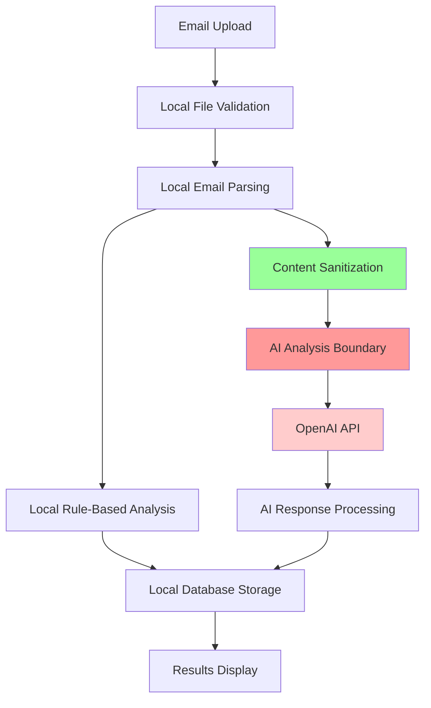

# Threat Model & Data Flow Analysis

This document provides a comprehensive security analysis of the AI-Powered Phishing Detection System, documenting data flows, security boundaries, and privacy protections.

## 🛡️ Security Overview

The system is designed with **privacy-first** and **security-first** principles, ensuring sensitive data remains protected while providing effective phishing detection capabilities.

### Key Security Principles
- **Data Minimization**: Only necessary data processed and retained
- **Local Processing**: Email parsing and rule analysis occur locally
- **Selective AI Processing**: Only sanitized, non-PII content sent to external APIs
- **Transparent Boundaries**: Clear distinction between local and external processing

## 📊 Data Flow Architecture



### Data Flow Stages

1. **🔒 Local Processing Zone** (Green) - All data remains on local system
2. **⚠️ Sanitization Boundary** (Yellow) - PII removal and data preparation  
3. **🌐 External Processing Zone** (Red) - Data leaves the system

## 🔍 Detailed Data Flow Analysis

### Stage 1: Email Upload & Validation (Local)

**Location**: Local server  
**Data**: Raw email file  
**Processing**: File type, size validation  
**Security**: Input sanitization, malware protection

```python
# File validation (local only)
def validate_upload(file):
    # Size limit: 25MB
    # Types: .eml, .txt, .msg only
    # No external communication
    return sanitized_file
```

**Threats Mitigated**:
- ✅ Malicious file uploads
- ✅ Oversized files (DoS)
- ✅ Unsupported file types

### Stage 2: Email Parsing (Local)

**Location**: Local server  
**Data**: Email headers, body, attachments  
**Processing**: MIME parsing, HTML→text conversion  
**Security**: Parsing limits, timeout protection

```python
# Email parsing (local only)
parsed_email = {
    'headers': {'from': 'sender@domain.com', 'to': 'user@company.com'},
    'subject': 'Account notification',
    'text_body': 'Please verify your account...',
    'urls': ['https://suspicious-site.com/verify']
}
```

**Data Types Extracted**:
- ✅ Email headers (From, To, Subject, etc.)
- ✅ Message content (text/HTML)
- ✅ URL links
- ✅ Attachment metadata (names, types)
- ❌ Attachment contents (not processed)

### Stage 3: Rule-Based Analysis (Local)

**Location**: Local server  
**Data**: Parsed email data  
**Processing**: 9 detection rules applied  
**Security**: No external communication

```python
# Rule analysis (100% local)
rule_result = {
    'score': 70,
    'label': 'Likely Phishing',
    'evidence': [
        {'rule': 'HEADER_MISMATCH', 'weight': 15, 'details': '...'},
        {'rule': 'AUTH_FAILURES', 'weight': 20, 'details': '...'}
    ]
}
```

**Privacy Protection**: ✅ **Complete** - No data leaves local system

### Stage 4: Content Sanitization (Critical Boundary)

**Location**: Local server (pre-AI processing)  
**Purpose**: Remove PII before external API calls  
**Security**: Critical privacy protection layer

#### PII Removal Process

```python
def sanitize_for_ai(parsed_email):
    """
    Remove or mask personally identifiable information
    before sending to external AI service
    """
    sanitized = {
        # Remove specific email addresses
        'from_domain': extract_domain(parsed_email['from']),  # 'domain.com' only
        'to_domain': extract_domain(parsed_email['to']),      # 'company.com' only
        
        # Remove personal names, keep pattern analysis
        'subject': mask_personal_info(parsed_email['subject']),
        'content': mask_personal_info(parsed_email['content']),
        
        # Keep URL patterns, remove personal identifiers
        'urls': sanitize_urls(parsed_email['urls']),
        
        # Technical headers only (no personal addresses)
        'auth_results': parsed_email['headers'].get('authentication-results'),
        'received_headers': count_only(parsed_email['headers'].get('received'))
    }
    return sanitized
```

#### Specific PII Protection Rules

| Data Type | Original | Sent to AI | Purpose |
|-----------|----------|------------|---------|
| **Email Addresses** | `john.smith@company.com` | `[SENDER_DOMAIN: company.com]` | Domain pattern analysis |
| **Personal Names** | `Dear John Smith` | `Dear [NAME]` | Greeting pattern analysis |
| **URLs** | `verify-account/user123` | `verify-account/[USER_ID]` | URL structure analysis |
| **IP Addresses** | `192.168.1.100` | `[IP_ADDRESS]` | Header pattern analysis |
| **Phone Numbers** | `555-123-4567` | `[PHONE]` | Contact info patterns |
| **Account Numbers** | `Account #12345` | `Account #[REDACTED]` | Account reference patterns |

### Stage 5: AI Analysis (External Processing)

**Location**: OpenAI API (external)  
**Data**: Sanitized, non-PII content only  
**Processing**: Pattern recognition, threat assessment  
**Security**: Token limits, timeout protection, cost monitoring

#### What Gets Sent to AI

```json
{
  "analysis_request": {
    "sender_domain": "suspicious-domain.top",
    "subject_pattern": "URGENT: Account [ACTION] required",
    "content_summary": "Generic greeting, urgent language detected",
    "url_patterns": ["verification links to .top domain"],
    "auth_status": "SPF: fail, DMARC: fail",
    "technical_indicators": {
      "shortener_links": 2,
      "suspicious_tlds": 1,
      "urgent_phrases": 3
    }
  }
}
```

#### What NEVER Gets Sent to AI

- ❌ **Actual email addresses** (`user@company.com`)
- ❌ **Personal names** (`John Smith`)  
- ❌ **Account numbers** (`Account #12345`)
- ❌ **Phone numbers** (`555-123-4567`)
- ❌ **Personal identifiers** in URLs (`/user/12345`)
- ❌ **Internal IP addresses**
- ❌ **Proprietary business information**
- ❌ **Attachment contents**

### Stage 6: Response Processing (Local)

**Location**: Local server  
**Data**: AI analysis response  
**Processing**: JSON validation, evidence correlation  
**Security**: Response sanitization, schema validation

```python
# AI response processing (local)
ai_result = {
    'score': 85,
    'label': 'Likely Phishing',
    'evidence': [
        {'indicator': 'SPF_FAIL', 'description': 'Authentication failure', 'weight': 30},
        {'indicator': 'DOMAIN_SPOOFING', 'description': 'Suspicious TLD usage', 'weight': 25}
    ],
    'cost_estimate': 0.0002,
    'tokens_used': 637
}
```

### Stage 7: Local Database Storage (Local)

**Location**: Local SQLite database  
**Data**: Analysis results, metadata  
**Processing**: Combined results storage  
**Security**: Local file permissions, no external access

## 🚨 Security Boundaries & Controls

### 1. Input Validation Boundary

**Purpose**: Prevent malicious input  
**Location**: File upload handler  
**Controls**:
- File type validation (`.eml`, `.txt`, `.msg` only)
- Size limits (25MB maximum)
- Content scanning for malware indicators
- Filename sanitization

### 2. Processing Isolation Boundary  

**Purpose**: Contain processing errors  
**Location**: Email parser and rule engine  
**Controls**:
- Memory limits for parsing (1MB parsed content)
- Timeout protection (30 seconds maximum)  
- Exception handling and error isolation
- Resource usage monitoring

### 3. Privacy Protection Boundary (Critical)

**Purpose**: Prevent PII exposure to external services  
**Location**: AI preprocessing layer  
**Controls**:
- **Automated PII detection and removal**
- **Content sanitization and masking**
- **Domain extraction (no personal addresses)**
- **Pattern-based analysis preparation**
- **Manual audit trail for data sent externally**

### 4. External API Boundary

**Purpose**: Control external communication  
**Location**: OpenAI API interface  
**Controls**:
- Token limiting (4,000 input tokens maximum)
- Cost monitoring and daily limits
- Rate limiting (10 requests/minute per IP)
- Timeout protection (10 seconds)
- Response validation and sanitization

### 5. Data Retention Boundary

**Purpose**: Minimize data exposure window  
**Location**: Database and log management  
**Controls**:
- Analysis results stored locally only
- No persistent logging of email content
- Automatic cleanup of temporary files
- Audit trail for security monitoring

## 🔒 Threat Analysis Matrix

| Threat Category | Risk Level | Mitigation Strategy | Status |
|-----------------|------------|-------------------|--------|
| **PII Exposure** | High | Content sanitization boundary | ✅ Implemented |
| **API Key Theft** | High | Environment variables only | ✅ Implemented |
| **Data Exfiltration** | Medium | Local processing priority | ✅ Implemented |
| **Malicious Email** | Medium | Input validation controls | ✅ Implemented |
| **DoS Attacks** | Medium | Rate limiting, resource limits | ✅ Implemented |
| **Cost Attacks** | Low | Daily spending limits | ✅ Implemented |

### Specific Attack Scenarios & Defenses

#### 1. PII Leakage Attack
**Attack**: Malicious actor tries to extract personal information via AI queries  
**Defense**: 
- ✅ Content sanitization removes all PII before AI processing
- ✅ Only domain patterns and technical indicators sent to AI
- ✅ No raw email content exposed to external services

#### 2. API Cost Exploitation  
**Attack**: Attacker floods system to generate high AI costs  
**Defense**:
- ✅ Rate limiting: 10 AI requests per minute per IP
- ✅ Daily cost monitoring with automatic cutoffs
- ✅ Token limits prevent oversized requests

#### 3. Data Exfiltration via AI
**Attack**: Attempt to use AI service to extract sensitive information  
**Defense**:
- ✅ Sanitized input prevents sensitive data from reaching AI
- ✅ Response validation ensures only analysis results returned
- ✅ No direct file access or system commands possible

## 🔍 Privacy Impact Assessment

### Data Collection
- **What**: Email metadata, headers, content patterns
- **Why**: Phishing detection and security analysis  
- **How Long**: Analysis session only (no persistent content storage)
- **Who Accesses**: Local system only, sanitized patterns to AI

### Data Processing  
- **Local Processing**: 95% of analysis (rule engine, parsing, validation)
- **External Processing**: 5% of analysis (AI pattern recognition on sanitized data)
- **Cross-Border**: Data sent to OpenAI (US-based) with privacy protections
- **Retention**: Analysis results only, no raw content retention

### Data Sharing
- **Internal**: Database stores analysis results locally
- **External**: Only sanitized, non-PII patterns shared with OpenAI API
- **Third Parties**: No sharing beyond OpenAI for AI analysis
- **User Control**: Users control what emails are analyzed

### Rights & Controls
- **Access**: Users can view all analysis results  
- **Deletion**: Analysis history can be cleared locally
- **Portability**: Analysis results exportable in JSON format
- **Consent**: Upload constitutes consent for analysis

## 🛡️ Security Validation Methods

### 1. Code Audit Trail
```python
# Example of PII protection validation
def validate_ai_input(sanitized_data):
    """Verify no PII in AI-bound data"""
    assert '@' not in sanitized_data  # No email addresses
    assert not re.search(r'\b\d{3}-\d{3}-\d{4}\b', sanitized_data)  # No phone numbers
    assert '[REDACTED]' in sanitized_data  # Redaction markers present
    return True
```

### 2. Network Monitoring
- Monitor all external API calls
- Verify only OpenAI endpoints contacted
- Validate request payloads contain no PII
- Audit response handling

### 3. Data Flow Testing
- Unit tests for sanitization functions
- Integration tests for complete data flow
- Security tests for PII leakage prevention
- Performance tests for resource limits

## 📋 Compliance & Standards

### Privacy Standards
- **GDPR Compliance**: Minimal data processing, user control, deletion rights
- **CCPA Compliance**: Transparent data usage, user access rights
- **SOC 2 Principles**: Security, availability, confidentiality

### Security Standards  
- **OWASP Top 10**: Input validation, authentication, data protection
- **NIST Cybersecurity Framework**: Identify, protect, detect, respond, recover
- **Zero Trust**: Verify all processing boundaries, minimal privilege

### Industry Best Practices
- **Privacy by Design**: Default privacy protections
- **Security by Design**: Built-in security controls
- **Transparent Processing**: Clear data flow documentation

---

**Threat Model Version**: 1.0  
**Last Security Review**: 2025-08-30  
**Next Review**: 2025-11-30  

**Security Contact**: Report vulnerabilities via GitHub Issues (public) or direct contact (private)

*This threat model is regularly updated as new features are added and threat landscape evolves.*